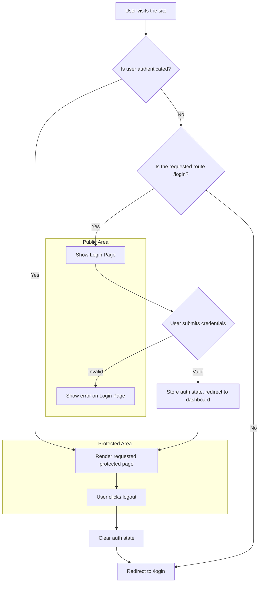
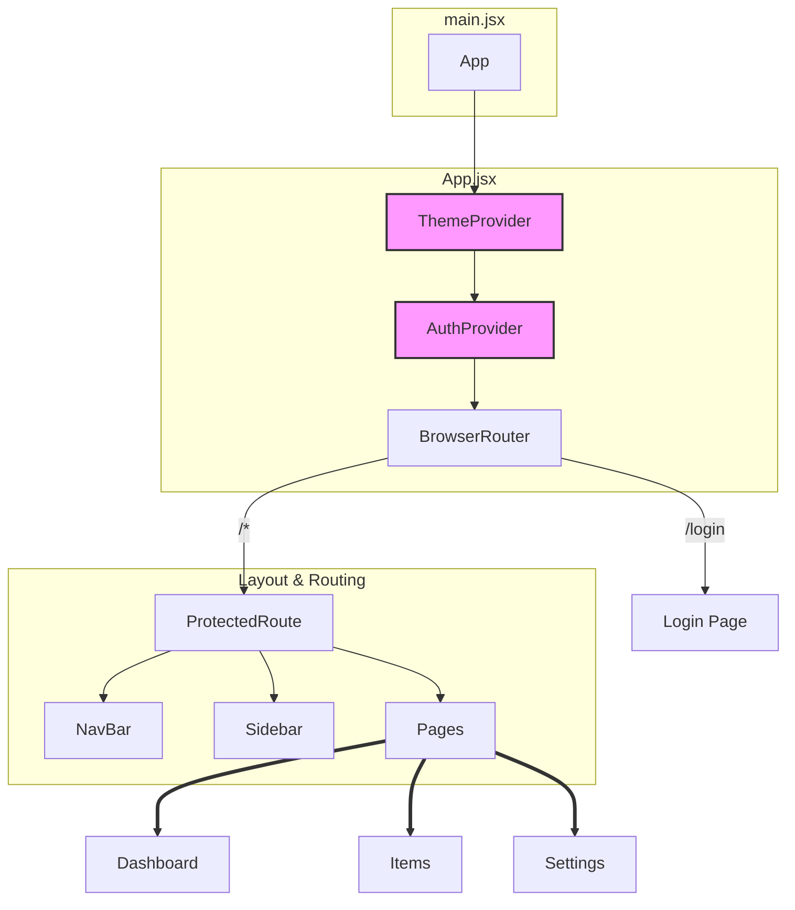

# Admin Portal

## Overview

This project is a comprehensive admin portal for the Nutriiya application, developed as a single-page application (SPA) using React and Vite. It provides administrators with a secure interface to manage various aspects of the application, such as items, users, and settings. The portal features a modern, responsive user interface built with Tailwind CSS, leveraging a component-based architecture and global state management for authentication and theme control.

## Features

- **Secure Authentication**: Access to the admin dashboard is protected, with a dedicated login page and route protection for all administrative routes.
- **Dashboard**: A central hub providing an overview and quick access to different management modules.
- **Item Management**: Read and Update functionality for application items (projects).
- **Dynamic Routing**: Utilizes `react-router-dom` for seamless navigation between different sections of the portal.
- **Theming**: Supports both light and dark modes, managed globally via a `ThemeContext`.
- **Lazy Loading**: Pages are lazy-loaded to improve initial load performance.
- **Error Handling**: Includes a top-level `ErrorBoundary` to gracefully handle rendering errors in components.
- **Responsive Design**: The UI is designed to be functional and aesthetically pleasing across various screen sizes.

## Tech Stack

- **Frontend**: React, Vite, JavaScript (ES6+)
- **Routing**: `react-router-dom`
- **Styling**: Tailwind CSS, Bootstrap (for specific components/resets)
- **State Management**: React Context API (`useContext`)
- **API Client**: Axios
- **Development Tools**: Vite Dev Server
- **Mock API**: `json-server` to serve data from `db.json`.

## Project Structure

```
c:\Users\singa\Desktop\admin-portal-app/
├── .gitignore
├── db.json
├── eslint.config.js
├── index.html
├── package.json
├── README.md
├── vite.config.js
├── node_modules/
├── public/
│   └── vite.svg
└── src/
    ├── App.jsx
    ├── index.css
    ├── main.jsx
    ├── style.css
    ├── assets/
    ├── Components/
    │   ├── ErrorBoundary.jsx
    │   ├── LoadingSpinner.jsx
    │   ├── NavBar.jsx
    │   └── Sidebar.jsx
    ├── context/
    │   ├── AuthContext.jsx
    │   └── ThemeContext.jsx
    ├── hooks/
    │   ├── useAuth.js
    │   └── useFetch.js
    ├── pages/
    │   ├── Dashboard.jsx
    │   ├── ItemDetails.jsx
    │   ├── Items.jsx
    │   ├── Login.jsx
    │   ├── NotFound.jsx
    │   ├── Settings.jsx
    │   └── UpdateItem.jsx
    └── routes/
        └── ProtectedRoute.jsx
```

## Application Flow (Flowcharts)

### Authentication Flow

This diagram illustrates how user authentication is handled and how protected routes are guarded.



### Component Architecture

This diagram shows the high-level component structure of the application.



## Key Modules & Components

### `src/context`

-   **`AuthContext.jsx`**: Provides authentication state (`isAuthenticated`, `loading`) to the entire application. It allows any component to check the current user's auth status and trigger login/logout actions.
-   **`ThemeContext.jsx`**: Manages the application's theme (e.g., 'light' or 'dark'). It allows users to toggle the theme and persists the preference.

### `src/hooks`

-   **`useAuth.js`**: A custom hook that simplifies access to the `AuthContext`. It is used by components that need to know the authentication status, such as `ProtectedRoute`.
-   **`useFetch.js`**: A generic custom hook for making asynchronous API calls. It handles loading states, data fetching, and potential errors, reducing boilerplate code in components.

### `src/routes`

-   **`ProtectedRoute.jsx`**: A critical component that acts as a gatekeeper for protected routes. It wraps the main application layout and uses the `useAuth` hook to check if a user is authenticated. If the user is not authenticated, it redirects them to the `/login` page.

### `src/Components`

-   **`NavBar.jsx`** & **`Sidebar.jsx`**: These components form the main layout of the authenticated application, providing navigation and consistent branding.
-   **`ErrorBoundary.jsx`**: A wrapper component that catches JavaScript errors in its child component tree, logs them, and displays a fallback UI instead of crashing the app.
-   **`LoadingSpinner.jsx`**: A reusable spinner component displayed during asynchronous operations, such as data fetching or initial auth checks.

## Pages (Routes)

The application uses `react-router-dom` to manage navigation. All routes except for `/login` are protected.

-   `/login`: **Login Page** - The public-facing entry point for users to authenticate.
-   `/dashboard`: **Dashboard** - The main landing page after successful login.
-   `/items`: **Items List** - Displays a list of all manageable items.
-   `/item/:id`: **Item Details** - Shows detailed information for a specific item.
-   `/update/:id`: **Update Item** - Provides a form to edit an existing item.
-   `/settings`: **Settings** - A page for administrators to configure application settings.
-   `*`: **Not Found** - A 404 page is shown for any undefined routes, both public and protected.

## Getting Started

### Prerequisites

-   Node.js (v18 or higher recommended)
-   npm or yarn

### Installation

1.  Clone the repository to your local machine:
    ```sh
    git clone <your-repository-url>
    cd admin-portal-app
    ```
2.  Install the necessary dependencies:
    ```sh
    npm install
    ```

### Running the Development Server

This command starts the Vite development server, typically on `http://localhost:5173`.

```sh
npm run dev
```

### Running the Mock API

To provide data for the application, a `json-server` is used to serve the `db.json` file. Run this command in a separate terminal:

```sh
npx json-server --watch db.json --port 3001
```

## Available Scripts

-   `npm run dev`: Starts the application in development mode.
-   `npm run build`: Bundles the application for production.
-   `npm run lint`: Lints the codebase using ESLint.
-   `npm run preview`: Serves the production build locally for previewing.